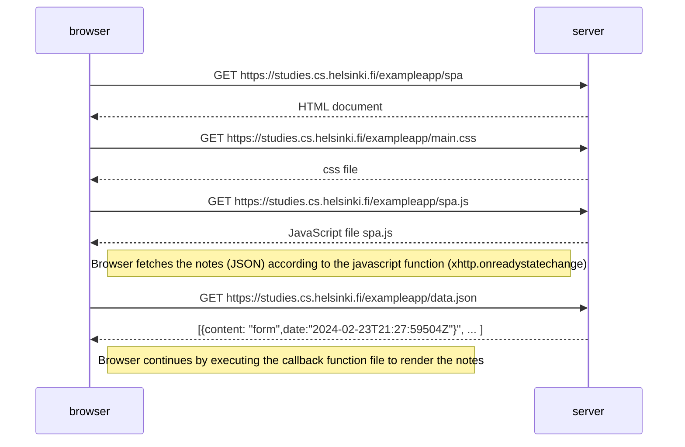

```mermaid
sequenceDiagram
    Participant browser
    Participant server
    browser->>server: GET https://studies.cs.helsinki.fi/exampleapp/spa
    server-->>browser: HTML document
    browser->>server: GET https://studies.cs.helsinki.fi/exampleapp/main.css
    server-->>browser: css file
    browser->>server: GET https://studies.cs.helsinki.fi/exampleapp/spa.js
    server-->>browser: JavaScript file spa.js

    Note right of browser: Browser fetches the notes (JSON) according to the javascript function (xhttp.onreadystatechange)

    browser->>server: GET https://studies.cs.helsinki.fi/exampleapp/data.json
    server-->>browser: [{content: "form",date:"2024-02-23T21:27:59504Z"}", ... ]

    Note right of browser: Browser continues by executing the callback function file to render the notes
```     